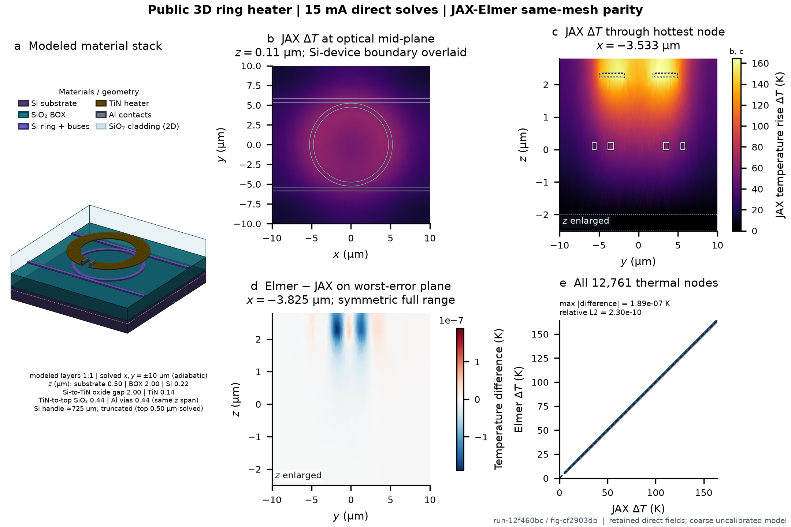

# Public 3D ring-heater reference



This bundle is figure `3d-ring-heater-figure-cf2903db94fb6f4d`, rendered from numerical run `3d-ring-heater-run-12f460bc7fc6db4f`. It uses the public
coarse ring recipe, one Gmsh mesh with 12,761 nodes and
71,808 first-order tetrahedra, and the 15 mA
source-pinned reproduction operating point. Native JAX and locked external Elmer independently solve the same discrete
current/Joule/heat problem at 0.688718 V. No displayed temperature
or parity field is obtained by rescaling another operating point.

The JAX peak temperature rise is 164.348 K. Across all
thermal nodes, the maximum direct-solve Elmer-JAX difference is
1.894e-07 K and the temperature-rise
relative L2 difference is 2.298e-10.
Across the partial conductor field, the maximum potential difference is
2.310e-10 V.

## Files

- `nodes.csv`: every 3D coordinate and both nodal temperature fields;
- `cells.csv`: every Tet4 connectivity row and material-region identity;
- `potential.csv`: every conductor node and both potential fields;
- `generation.uv.lock`: the exact dependency lockfile recorded for the numerical run;
- `evidence.json`: thresholds, process/numerical/scientific states, source identities, hashes,
  figure rules, and raw-run references;
- `figure.svg` and `figure.png`: publication-scale vector container and 300 dpi preview.

## Reproduce

Re-render the presentation from the checked open fields without starting an external process:

```bash
uv run python examples/readme_3d_ring_heater_reference.py \
  --render-existing docs/assets/readme/3d_ring_heater_reference \
  --output /temporary/new/rendered-bundle
```

To rebuild the mesh, numerical fields, and presentation, run this from a locked femx checkout
with a clean locked Elmer source checkout:

```bash
JAX_PLATFORMS=cpu JAX_ENABLE_X64=1 uv run python \
  examples/readme_3d_ring_heater_reference.py \
  --allow-external \
  --gmsh /absolute/path/to/gmsh \
  --elmer /absolute/path/to/ElmerSolver \
  --elmer-source /absolute/path/to/elmerfem \
  --operating-point source_reproduction \
  --output /temporary/empty/output/directory
```

The command starts external processes and therefore requires the explicit flag. It never downloads
or installs dependencies. Raw GEO/MSH, native Elmer mesh/SIF/result/VTU, and process logs are kept
under the ignored `.femx/readme-3d-ring-heater/` run directory and are bound by hashes in the
evidence file.

## Claim boundary

This is a same-discretization parity and conservation result for one coarse, constant-property,
uncalibrated public 3D benchmark. It is not formal mesh convergence, a continuum solution, a
physical TPU run, an FDTDX resonance response, a foundry model, or a fabricated-device prediction.
The 3D panel preserves the source-pinned `PublicRingHeater3D` layer elevations and renders the
materials explicitly from bottom to top: the 0.5 um modeled silicon substrate, the complete 2.0 um
SiO2 BOX, the 0.22 um silicon ring and buses, and the TiN heater and aluminum contacts. The panel
continues the modeled substrate downward as one uninterrupted Si solid rather than adding a second
plate. A dashed line marks the lower boundary of the solved 0.5 um Si region; below it, a short
depth-truncated segment stands for an approximately 725 um nominal handle wafer and is explicitly
not to scale or solved. The upper cladding volume is omitted from panel a; two faint far-side planes
mark its x-min and y-max extent as a 2D backdrop. Those planes are drawn with the BOX before every
device solid and are not rendered solids; these choices change only presentation, not the solved
geometry. Panel a uses an orthographic axonometric view, with one-to-one micrometre scale restricted
to solved geometry. Its annotation states the +/-10 um solved lateral extent and adiabatic sides and
includes the 0.44 um TiN-to-top silica and 0.44 um aluminum-via heights; those two features share
the same z span rather than stacking. Panel a contains categorical material geometry only: no
temperature field or isosurface is overlaid on the TiN or any other material. Panels b and c carry
the direct JAX temperature field on one shared linear `inferno` scale. Panel b deliberately omits
scalar isolines and identifies its single muted-neutral overlay as the source-CAD Si-device
boundary. Panel c uses
white device silhouettes with a thin dark contrast stroke so the geometry remains visible across
the complete inferno luminance range. Field axes retain physical coordinates and all color scales
use the complete retained range without clipping. Panels b and c use the linear perceptually
uniform `inferno` sequential map; the signed panel-d difference uses a zero-centered, symmetric `RdBu_r`
diverging scale. Panel-a materials use the bundled light-canvas categorical material palette
v1.1: Si substrate `#4B3F72`, device Si `#685AB8`, SiO2/TEOS `#167786`,
TiN `#604900`, and Al `#6F7885`, with their paired frame colours retained in figure metadata. BOX
and cladding extent share the same SiO2 fill and differ by opacity. Panels b and c add the matching
source-CAD geometry as restrained muted-neutral outlines with a thin dark contrast stroke; line
style distinguishes material roles in panel c, and outline colour never encodes a scalar value.
The content-addressed run identifier excludes presentation code; the figure identifier combines
that run identifier with the explicit rendering policy. A redraw can therefore change the figure
identifier without implying a new numerical solve.
