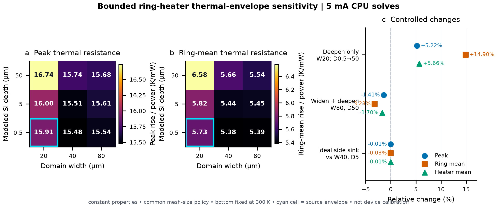

# Public ring-heater thermal scope and operating points

## Purpose

The public 3D ring-heater case has two operating-point roles and two distinct field bundles that
must not be merged:

- the source-pinned 15 mA case is the immutable JAX-Elmer same-discretization benchmark; and
- the 5 mA role selects a lower-temperature point by linear scaling, while a separate bundle
  retains new JAX and Elmer solves performed at that selected voltage.

Neither operating point is a calibrated fabricated-device prediction. In particular, copying a
current or voltage from another heater does not transfer its dissipated power because resistance,
heater geometry, contact layout, and material process differ.

## Exact thermal envelope

The source-pinned model uses a 20 um by 20 um solid domain. Beneath the 2 um buried oxide, only
0.5 um of silicon substrate is represented. The thermal boundaries are:

- 300 K prescribed on the substrate bottom at $z=-2.5$ um;
- convection to 300 K with $h=10$ W m$^{-2}$ K$^{-1}$ on the complete top plane; and
- zero normal heat flux on all four lateral sides.

The lateral condition does not make the finite-element field mathematically one-dimensional: heat
still spreads in all three coordinates inside the domain. It does prevent heat from leaving
through the sidewalls. In the retained coarse result, 10.330456 mW leaves through the fixed bottom
and 0.000315 mW leaves through top convection, out of 10.330771 mW generated electrically. Thus
about 99.997 percent of the modeled heat exits through the bottom.

The 0.5 um substrate is a deliberate truncation inherited from the public tutorial geometry, not
a full SOI handle wafer or a packaged die. The small lateral extent, adiabatic sides, nearby fixed
temperature, omitted package, and constant properties jointly define the reported temperature.
Their net bias cannot be assigned to substrate thickness alone without a domain and boundary
sensitivity study.

The initial bounded study below varies lateral extent and modeled silicon depth together. It does
not replace the full device-representative gate.

## Source-reproduction result

The retained coarse JAX-Elmer bundle gives the following JAX observables at 15 mA:

| Quantity | Value |
|---|---:|
| Modeled terminal voltage | 0.688718 V |
| Modeled terminal resistance | 45.9145 ohm |
| Joule power | 10.3308 mW |
| Peak temperature rise | 164.348 K |
| Silicon-ring volume-mean rise | 59.164 K |
| TiN-heater volume-mean rise | 152.587 K |
| Peak rise per power | 15.9085 K/mW |
| Ring-mean rise per power | 5.7270 K/mW |
| Heater-mean rise per power | 14.7701 K/mW |

The 164.348 K rise is therefore a valid result for the stated discrete benchmark, but it is not a
recommended operating temperature. At the resulting 464.348 K peak, the constant-property model
is especially unsuitable as a quantitative device predictor.

## Lower-temperature linear projection

Electrical conductivity, thermal conductivity, and convection are constant in this benchmark. If
the current ratio is $r=I/I_0$, the exact model scaling is

$$
V=rV_0,\qquad P=r^2P_0,\qquad \Delta T=r^2\Delta T_0.
$$

Choosing 5 mA gives $r=1/3$ and the following projection of the retained coarse solution:

| Quantity | 15 mA source reproduction | 5 mA linear projection |
|---|---:|---:|
| Voltage | 0.688718 V | 0.229573 V |
| Joule power | 10.3308 mW | 1.14786 mW |
| Peak temperature rise | 164.348 K | 18.2608 K |
| Ring-mean temperature rise | 59.164 K | 6.57381 K |
| Heater-mean temperature rise | 152.587 K | 16.9541 K |

The 5 mA column is the exact algebraic prediction under the committed linear assumptions. The
projection itself is not a second JAX or Elmer solve. It selects the lower-current operating point
but supplies no independent field evidence by itself.

For the public figure, JAX and locked external Elmer were then run again at the selected
0.229573 V target. The new direct JAX solution gives 1.147863 mW, an 18.260842 K peak rise, a
6.573805 K ring-mean rise, and a 16.954079 K heater-mean rise. Across all 12,761 thermal nodes,
the direct Elmer-JAX maximum temperature difference is $2.1169\times10^{-8}$ K and the relative
L2 temperature-rise difference is $2.3073\times10^{-10}$; the maximum conductor-potential
difference is $7.7182\times10^{-11}$ V. The agreement with the projected observables is expected
for this linear model, but the retained 5 mA fields and parity metrics are outputs of actual target
solves rather than rescaled 15 mA arrays. The [direct 5 mA open-field
bundle](../assets/readme/3d_ring_heater_5ma_reference/README.md) records both fields, process and
numerical states, source identities, and hashes.

Neither the algebraic prediction nor the direct rerun repairs the truncated thermal domain or
establishes device accuracy.

The two roles are separate typed application records. The existing calibration function remains
source-pinned to 15 mA; selecting 5 mA requires the explicit projection API:

```python
from femx.applications import (
    project_public_ring_heater_current,
    public_ring_heater_operating_point,
)

operating_point = public_ring_heater_operating_point("low_temperature_projection")
calibration = project_public_ring_heater_current(
    unit_voltage_joule_power_w,
    operating_point=operating_point,
)
```

## Initial bounded thermal-envelope sensitivity



Ten one-device CPU float64 solves use the 5 mA operating point, constant properties, and one
common mesh-size policy. Nine cases cross square-domain widths of 20, 40, and 80 um with modeled
silicon depths of 0.5, 5, and 50 um. The tenth replaces the adiabatic sidewall of the 40 um by
5 um case with an ideal 300 K sidewall sink.

At fixed 20 um width, increasing modeled silicon depth from 0.5 to 50 um changes peak and
ring-mean thermal resistance by +5.22 and +14.90 percent. Expanding both dimensions to 80 um by
50 um changes them by -1.41 and -3.23 percent relative to the source envelope. The ideal sidewall
sink changes the matched 40 um by 5 um case by only -0.014 percent peak and -0.027 percent ring
mean. In this boundary formulation, moving the fixed-temperature bottom farther away can increase
thermal resistance, while added lateral silicon provides a competing spreading path.

These results do not support the specific causal claim that the 0.5 um substrate truncation alone
creates the high source-envelope temperature. They also do not establish that the original domain
is converged or device-representative: the tested depth stops at 50 um, the bottom remains fixed at
300 K, the largest width is 80 um, properties remain constant, and no die/package/chuck impedance
or measurement is present. The [open summary and complete retained evidence](../assets/readme/ring_heater_thermal_sensitivity/README.md)
record every mesh, boundary, solve, and plotted value.

## Literature context

Current is not a portable heater metric. A measured TiN heater reported in a 2024 *Nature
Communications* microring study had about 500 ohm resistance and was swept from 0 to 4 V, with
about 73 pm/mW tuning and about 39 mW required for a pi phase shift. At the same 5 mA current, that
500 ohm heater would dissipate 12.5 mW, whereas the femx coarse model dissipates only 1.148 mW
because its modeled resistance is 45.9 ohm. This comparison is arithmetic context, not validation
of either geometry. See [the primary article](https://doi.org/10.1038/s41467-024-45301-3).

For temperature normalization, Coenen et al. measured an average tungsten-heater rise of
7.03 C/mW on 5 um-radius silicon ring modulators. Their calibrated non-undercut models reported
3.07-3.82 C/mW for the ring-waveguide mean and 6.44-7.19 C/mW for the heater mean, with a
probestation boundary model using top convection, an isothermal bottom, and adiabatic die sides.
The heater material and stack differ from femx, so these values are comparison context rather than
an acceptance band. See the
[IEEE article](https://doi.org/10.1109/TDMR.2022.3187822) and
[the accepted manuscript hosted by imec](https://imec-publications.be/server/api/core/bitstreams/43667e4d-1e64-4ff7-bf26-1581078f5137/content).

These examples support reporting power and K/mW alongside current and voltage. They do not supply
a universal current, voltage, or thermal resistance for a different TiN geometry.

## Gate for a device-representative model

A separate model may be called device-representative only after all of the following are bound and
tested without altering the 15 mA parity benchmark:

1. identify the intended wafer, die, package, chuck, and ambient configuration;
2. represent the actual handle-wafer thickness or a validated equivalent backside thermal
   impedance;
3. enlarge the lateral domain until peak, ring-mean, and heater-mean K/mW are insensitive to its
   extent, and vary lateral and backside boundary models independently;
4. use process-appropriate heater resistance, contact resistance, and temperature-dependent
   properties over the admitted temperature range;
5. compare modeled heater and waveguide K/mW with resistance-thermometry and optical-shift
   measurements on the target process; and
6. select an operating point from power, current density, peak temperature, optical tuning, and
   reliability limits rather than from current alone.

Until those gates close, femx should retain the 15 mA result as source-reproduction parity, use the
separately retained direct 5 mA result only as a low-temperature software-parity benchmark, and
avoid a fabricated-device claim.
